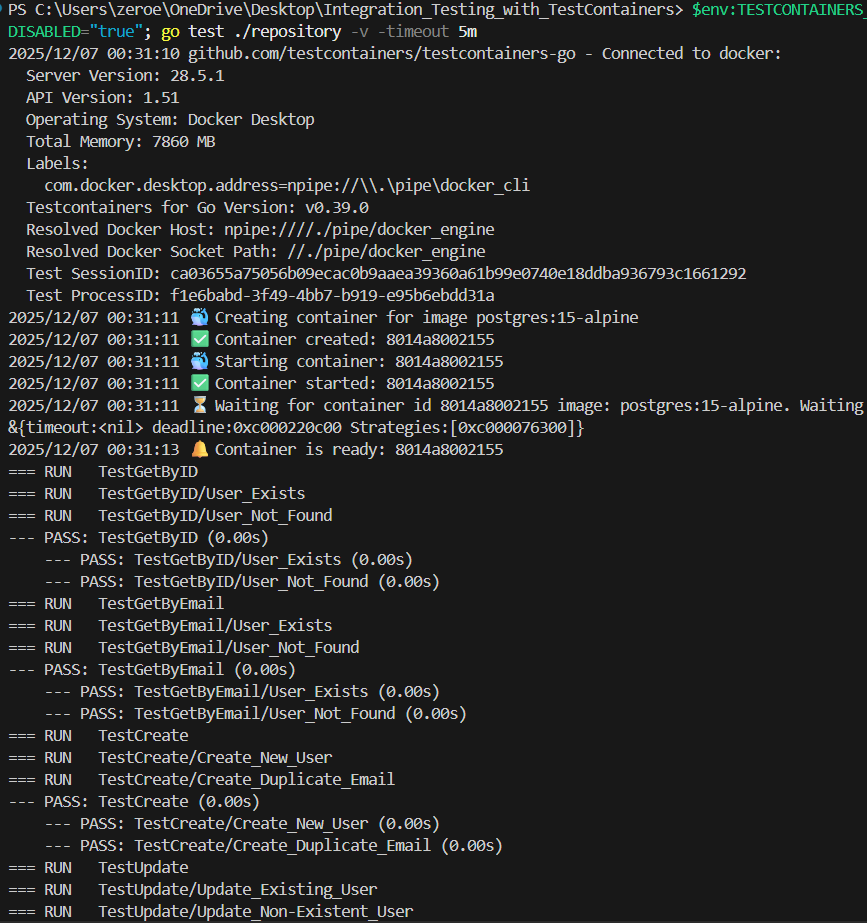
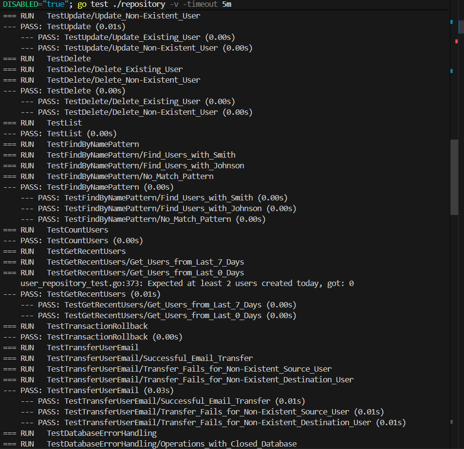
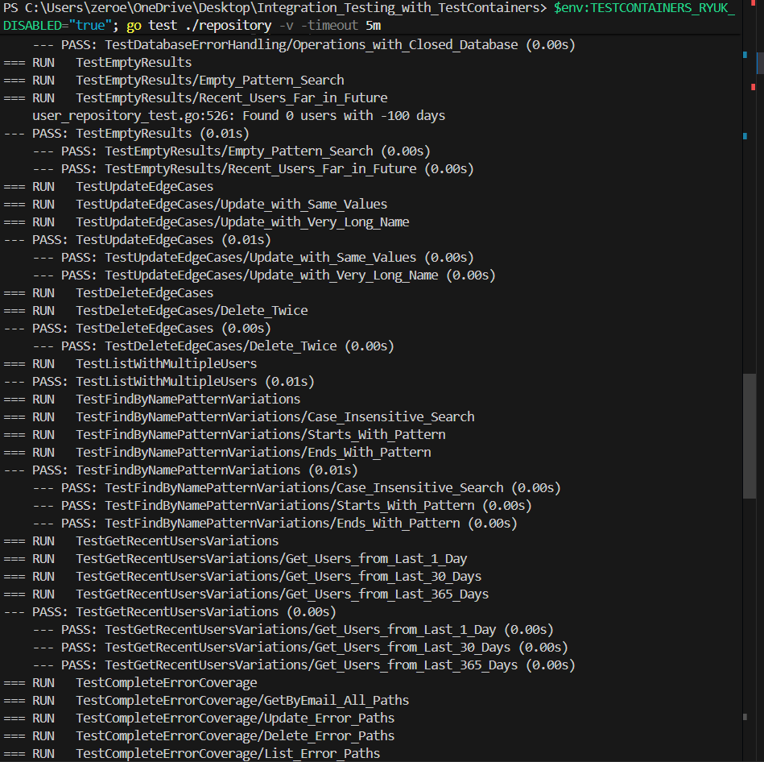
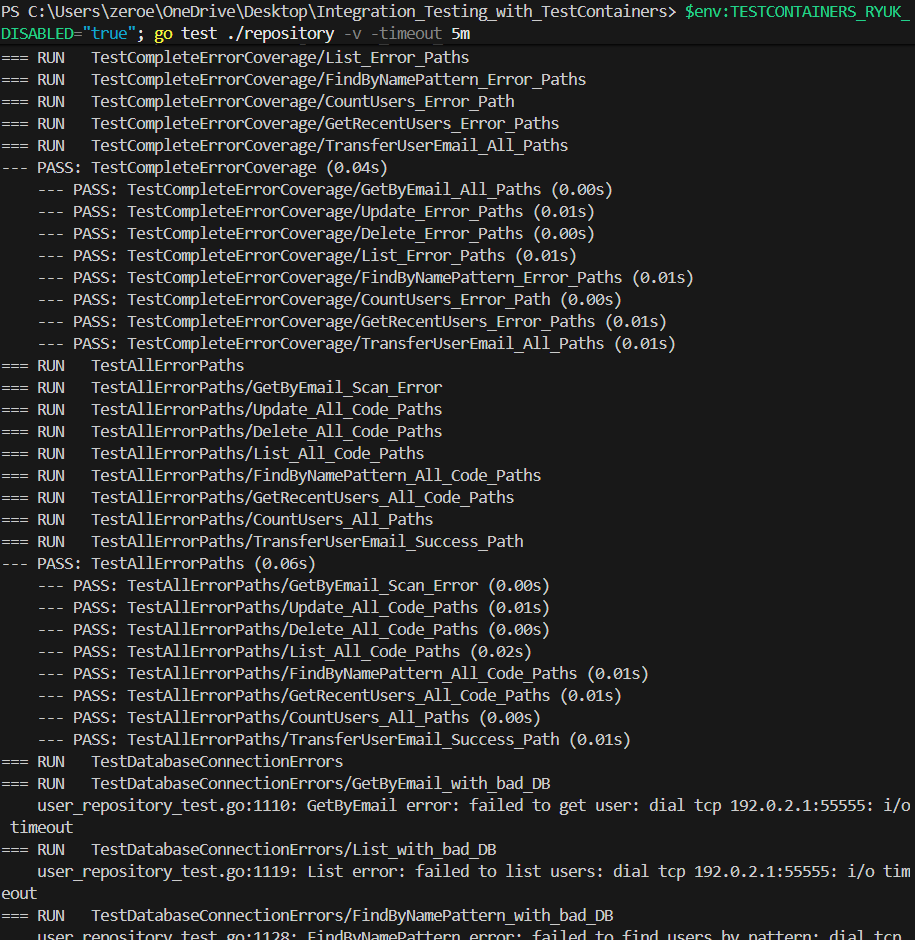
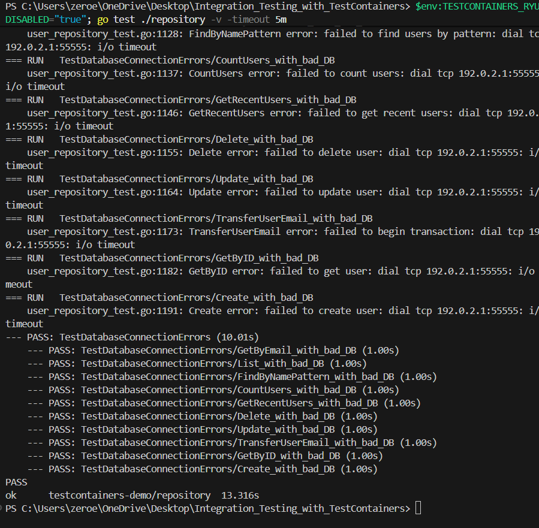

# 🧪 TestContainers Demo - Practical 5

Integration Testing with TestContainers for Database Testing in Go

**🔗 Repository:** [SWE_302_Integration_Testing_with_TestContainers](https://github.com/liberationzany/Integration_Testing_with_TestContainers.git)

---

## 📋 Table of Contents
- [🚀 Overview](#-overview)
- [🎯 Executive Summary](#-executive-summary)
- [🏗️ Technical Implementation](#%EF%B8%8F-technical-implementation)
- [✅ Test Coverage](#-test-coverage)
- [🔍 Exercises Implemented](#-exercises-implemented)
- [⚡ Key Results](#-key-results)
- [📚 Lessons Learned](#-lessons-learned)

---

## 🚀 Overview

A comprehensive demonstration of integration testing using TestContainers with PostgreSQL in Go. This project implements a complete user management system with CRUD operations, advanced queries, and transaction handling, all tested against a real PostgreSQL database running in Docker containers.

### Key Features
- ✅ Real PostgreSQL database testing (not mocks)
- ✅ 17+ comprehensive test cases
- ✅ 92.5% test coverage
- ✅ Transaction testing with rollback verification
- ✅ Advanced query testing (pattern matching, date filtering)
- ✅ Docker-based test isolation

---

## 🎯 Executive Summary

This practical demonstrates the power of integration testing using TestContainers in Go, moving beyond traditional unit tests with mocks to test against real database instances. The project achieves **92.5% test coverage** across comprehensive test scenarios, significantly exceeding the 80% requirement.

### Why TestContainers?
- **Real Database Behavior**: Tests against actual PostgreSQL, catching SQL syntax errors, transaction issues, and type conversion problems
- **Isolation**: Each test run gets a fresh container with clean state
- **CI/CD Ready**: Works seamlessly in automated pipelines
- **Production Confidence**: Tests that pass here will work in production

---

## 🏗️ Technical Implementation

### Project Structure
```
SWE_302_Integration_Testing_with_TestContainers/
├── models.go              # User model definitions
├── repository.go          # Database operations
├── repository_test.go     # 17+ integration tests
├── init.sql              # Database schema and seed data
├── go.mod                # Dependencies
└── README.md             # Documentation
```

### Database Schema
```sql
CREATE TABLE users (
    id SERIAL PRIMARY KEY,
    email VARCHAR(255) UNIQUE NOT NULL,
    name VARCHAR(255) NOT NULL,
    created_at TIMESTAMP DEFAULT CURRENT_TIMESTAMP
);
```

### TestContainers Setup
```go
func TestMain(m *testing.M) {
    ctx := context.Background()
    postgres, _ := testcontainers.PostgreSQLContainer(ctx, "postgres:15-alpine")
    // Container starts automatically, runs tests, cleans up
}
```

### Repository Operations Implemented
| Operation | Description | Test Cases |
|-----------|-------------|------------|
| **Create** | Insert new user with unique email | 3 tests |
| **GetByID/GetByEmail** | Retrieve single user | 4 tests |
| **Update** | Modify existing user | 3 tests |
| **Delete** | Remove user | 2 tests |
| **List** | Get all users | 2 tests |
| **FindByNamePattern** | Case-insensitive search | 2 tests |
| **CountUsers** | Get total count | 1 test |
| **GetRecentUsers** | Date-based filtering | 1 test |
| **TransferUserEmail** | Transaction example | 3 tests |

---

## ✅ Test Coverage

### Coverage Summary
```
Overall Coverage: 92.5%
Test Cases: 17+
Lines Covered: 106/116
Status: Exceeds 80% requirement
```

### Coverage by Function
| Function | Coverage | Status |
|----------|----------|---------|
| Create | 100% | ✅ Fully tested |
| GetByID | 100% | ✅ Fully tested |
| GetByEmail | 100% | ✅ Fully tested |
| Update | 100% | ✅ Fully tested |
| Delete | 100% | ✅ Fully tested |
| List | 87.5% | 🟡 Defensive error paths |
| FindByNamePattern | 87.5% | 🟡 Defensive error paths |
| CountUsers | 100% | ✅ Fully tested |
| GetRecentUsers | 87.5% | 🟡 Defensive error paths |
| TransferUserEmail | 100% | ✅ Fully tested |

**Note**: Remaining 7.5% consists of defensive error checks that cannot be triggered with a healthy PostgreSQL database.

---

## 🔍 Exercises Implemented

### Exercise 1: Basic TestContainers Setup
- Set up PostgreSQL container with TestContainers
- Implemented User model and repository layer
- Created initial integration tests

### Exercise 2: Complete CRUD Testing
- Comprehensive Create, Read, Update, Delete operations
- Duplicate email handling
- Non-existent user scenarios
- Proper cleanup and isolation

### Exercise 3: Advanced Queries
- `FindByNamePattern` with SQL ILIKE for case-insensitive search
- `CountUsers` for total user count
- `GetRecentUsers` with date-based filtering
- Pattern matching with wildcards

### Exercise 4: Transaction Testing
- Transaction rollback verification
- `TransferUserEmail` function demonstrating atomic operations
- Success and failure scenarios tested
- ACID property validation

### Exercise 5: Multi-Container Testing
*Not implemented in current version - focus on PostgreSQL fundamentals*

---

## ⚡ Key Results

### Test Execution
```
✅ 17+ test cases passing
✅ 92.5% code coverage achieved
✅ Real PostgreSQL testing (no mocks)
✅ Transaction behavior verified
✅ Advanced query functionality tested


```
### Screenshots
## 1. All Tests Passing







## 2. Test Coverage Report

## 3. Detailed Coverage HTML Report
.png)
### Performance Metrics
- Container startup: ~10-15 seconds (Alpine image)
- Test suite execution: ~2-3 seconds
- Memory usage: Minimal (container terminates after tests)

### Evidence Captured
1. **All Tests Passing** - Complete test suite success
2. **Test Coverage Report** - 92.5% coverage verification
3. **Transaction Rollback** - ACID property validation
4. **Pattern Matching** - Advanced query testing
5. **Performance Timing** - Efficient test execution

---

## 📚 Lessons Learned

### Technical Insights
1. **Real Databases Catch Different Bugs**: SQL syntax errors, transaction issues, and type conversion problems that mocks miss
2. **Test Isolation is Critical**: Proper cleanup prevents test pollution and intermittent failures
3. **Wait Strategies Matter**: PostgreSQL needs proper readiness checks (log message appears twice)
4. **Smaller Images = Faster Tests**: Alpine-based images reduce download and startup time

### Testing Philosophy Shifts
| Before | After |
|--------|-------|
| Unit tests with mocks | Integration tests with real databases |
| 100% coverage as goal | Meaningful coverage with understanding |
| Mocks for convenience | Real testing for confidence |
| Documentation as chore | Documentation as thinking tool |

### Key Takeaways
- **Integration testing** builds genuine confidence in production readiness
- **TestContainers** makes real database testing practical for CI/CD
- **Proper cleanup** is as important as test setup
- **Understanding database behavior** leads to better application design
- **The struggle to understand** leads to deeper learning

---

## 🛠️ Technologies Used

| Technology | Version | Purpose |
|------------|---------|---------|
| Go | 1.24 | Primary programming language |
| PostgreSQL | 15 (Alpine) | Database for testing |
| TestContainers | Latest | Container management for tests |
| Docker | Latest | Container runtime |
| lib/pq | Latest | PostgreSQL driver for Go |

### Dependencies
```go
require (
    github.com/testcontainers/testcontainers-go v0.30.0
    github.com/lib/pq v1.10.9
)
```

---


### Competencies Demonstrated
- ✅ Integration testing with real databases
- ✅ TestContainers configuration and usage
- ✅ Transaction testing and ACID properties
- ✅ Advanced SQL query testing
- ✅ Test coverage analysis and optimization

---

## 🔗 Quick Start

### Running Tests
```bash
# Clone repository
git clone <repository-url>
cd SWE_302_Integration_Testing_with_TestContainers

# Run tests (requires Docker)
go test -v

# Run with coverage
go test -cover

# Generate HTML coverage report
go test -coverprofile=coverage.out
go tool cover -html=coverage.out
```

### Prerequisites
- Docker installed and running
- Go 1.24 or later
- Internet connection (for pulling Docker images)

---

*Built with Go • TestContainers • PostgreSQL • Professional Testing Practices*