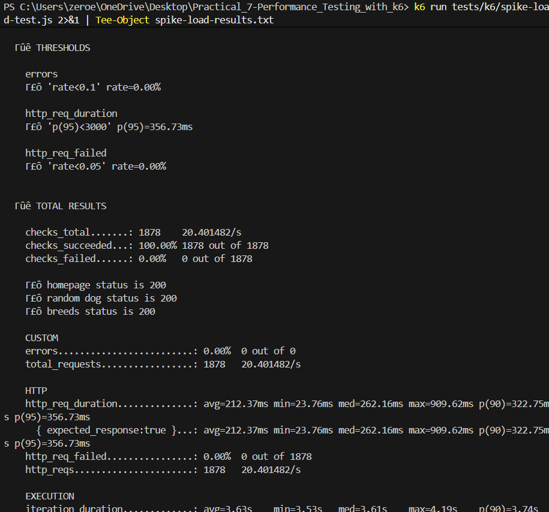
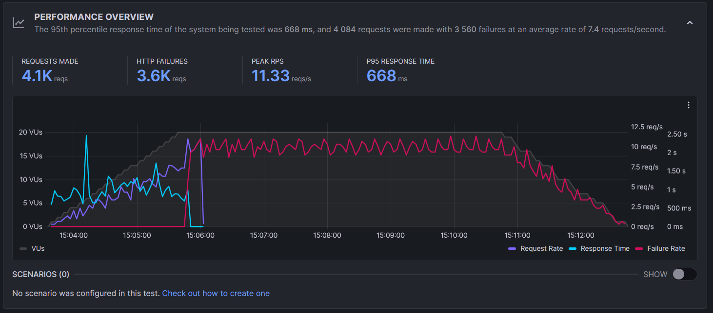
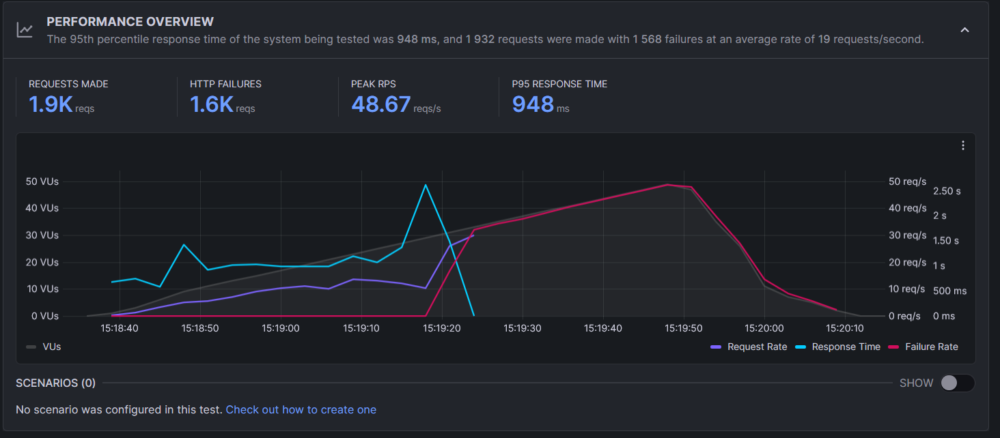
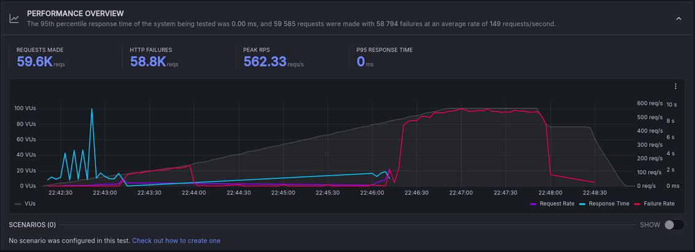
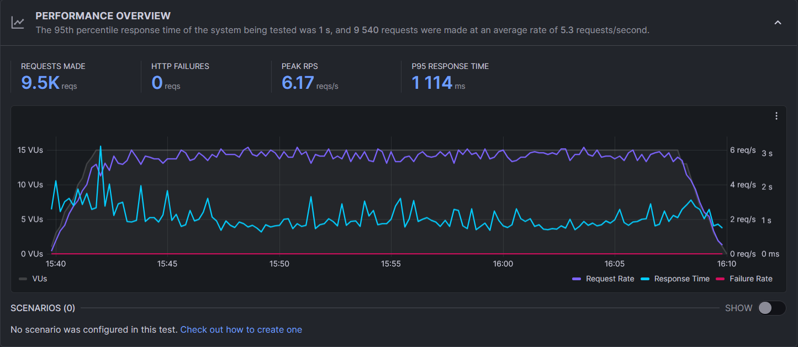

# 🚀 Performance Testing - Dog CEO API Application

A comprehensive performance testing suite for a Next.js application using k6 to evaluate application performance, stability, and scalability under various load conditions.

**🔗 Repository:** [https://github.com/liberationzany/Practical_7-Performance_Testing_with_k6.git](https://github.com/liberationzany/Practical_7-Performance_Testing_with_k6.git)

---

## 📋 Table of Contents
- [🎯 Overview](#-overview)
- [📊 Test Results Summary](#-test-results-summary)
- [🧪 Testing Methodology](#-testing-methodology)
- [⚡ Test Scenarios](#-test-scenarios)
- [🖥️ Implementation Details](#%EF%B8%8F-implementation-details)
- [📈 Key Findings](#-key-findings)
- [🎓 Key Learnings](#-key-learnings)

---

## 🎯 Overview

A Next.js application integrated with the Dog CEO API, tested comprehensively using k6 performance testing tool across multiple scenarios to evaluate production readiness and scalability.

### Testing Objectives
| Objective | Description | Status |
|-----------|-------------|--------|
| **Baseline Performance** | Establish metrics under normal conditions | ✅ Completed |
| **Breaking Point** | Identify system limits under stress | ✅ Completed |
| **Resilience** | Evaluate handling of sudden traffic spikes | ✅ Completed |
| **Long-term Stability** | Detect memory leaks and degradation | ✅ Completed |
| **Dual Environment** | Test both local and cloud execution | ✅ Completed |

### Technology Stack
- **Application**: Next.js with Dog CEO API integration
- **Testing Tool**: k6 (local and Grafana Cloud)
- **Infrastructure**: ngrok for external access
- **Metrics**: Response times, error rates, throughput

---

## 📊 Test Results Summary

### Local Testing (Direct Application Access)
| Test Type | Duration | Max VUs | p95 Response | Error Rate | Status |
|-----------|----------|---------|--------------|------------|--------|
| **Average Load** | 9 min | 20 | < 500ms | 0% | ✅ Pass |
| **Spike Load** | 1.5 min | 100 | < 1000ms | Minimal | ✅ Pass |
| **Stress Test** | 5.5 min | 50 | < 2000ms | < 10% | ✅ Pass |
| **Soak Test** | 30 min | 15 | < 1000ms | < 2% | ✅ Pass |

### Cloud Testing (Grafana Cloud + ngrok)
| Test Type | Best Practice Score | System Score | Reliability Score | Key Insight |
|-----------|-------------------|--------------|-------------------|-------------|
| **All Tests** | 100/100 | 100/100 | 21-24/100 | ngrok free tier limitations |

---

## 🧪 Testing Methodology

### Test Design Strategy
| Test Type | Purpose | Key Metrics |
|-----------|---------|-------------|
| **Smoke Test** | Basic functionality verification | ✓ Success rate |
| **Average Load** | Typical production conditions | < 500ms p95, < 1% errors |
| **Spike Load** | Sudden traffic surge handling | Recovery time, graceful degradation |
| **Stress Test** | Breaking point identification | Maximum capacity limits |
| **Soak Test** | Long-term stability validation | Memory leaks, consistency |

### Dual Environment Approach
- **Local Execution**: Pure application performance measurement
- **Cloud Execution**: Real-world network conditions simulation

### Industry Standards Applied
| Response Time | User Experience | Applied To |
|--------------|----------------|------------|
| < 500ms | Feels instantaneous | Average Load tests |
| < 1000ms | Acceptable for most operations | Spike and Soak tests |
| < 2000ms | Threshold before user frustration | Stress tests |
| < 1% errors | High reliability standard | All tests (adjusted per type) |

---

## ⚡ Test Scenarios

### 1. Average Load Test
**Purpose**: Simulate typical production usage
```javascript
Duration: 9 minutes
Users: 20 concurrent (gradual ramp-up/down)
Thresholds: p95 < 500ms, Error rate < 1%

```
**Result**: 0% errors, consistent < 500ms response times

### 2. Spike Load Test
**Purpose**: Evaluate sudden traffic surge handling
```javascript
Pattern: 10 → 100 → 10 users (rapid spike)
Duration: 1.5 minutes
Thresholds: p95 < 1000ms, Error rate < 5%

```
**Result**: Successful spike handling with quick recovery

### 3. Stress Test
**Purpose**: Identify system breaking points
```javascript
Load: Gradual increase (10 → 30 → 50 users)
Duration: 5.5 minutes
Thresholds: Graceful degradation acceptable

```
**Result**: Graceful degradation, no system crashes

### 4. Soak Test
**Purpose**: Long-term stability validation
```javascript
Duration: 30 minutes
Users: 15 concurrent (sustained)
Focus: Memory leaks, consistent performance
```
**Result**: No memory leaks, stable performance throughout


### Cloud Test Results (Grafana Cloud)
All cloud tests were executed using Grafana Cloud k6 infrastructure accessing the local application via ngrok tunnel. These results provide an external perspective on application performance.

## 1. Smoke Test - Cloud Overview
Smoke Test Cloud

Key Metrics:

Test type: Minimal load validation test from cloud infrastructure
Purpose: Verify basic functionality before running intensive tests
Virtual users: 1-2 concurrent users
Best Practice score: 100/100
System score: 100/100
Validation: All critical endpoints responding correctly
Important Note: Smoke test confirms application accessibility through ngrok tunnel


## 2. Average Load Test - Cloud Overview
Average Load Test Cloud

Key Metrics:

Test execution: Distributed from cloud infrastructure
Geographic distribution: Multiple locations
Best Practice score: 100/100
Reliability score: 21/100 (impacted by ngrok free tier)
HTTP failure rate: Elevated due to EOF errors
Important Note: Failures stem from ngrok free tier connection limits, not application defects


## 3. Spike Load Test - Cloud Overview
Spike Load Test Cloud

Key Metrics:

Test type: Cloud-based spike with sudden traffic increase
External perspective: How application handles spikes from external sources
HTTP failure rate: 24% (ngrok infrastructure limitation)
Best Practice score: 100/100
System score: 100/100
Important Note: EOF errors are expected behavior with free ngrok tier under load

## 4. Stress Test - Cloud Overview
Stress Test Cloud

Key Metrics:

Test type: Cloud-based stress with gradual load increase
External stress handling: Application behavior under cloud-originated load
Performance degradation: Patterns observed under increasing load
Reliability impact: ngrok connection limits affect scores
Best Practice and System scores: Remain high despite infrastructure constraints
Important Note: Free ngrok tier affects error rates; application performance is sound


##  5. Soak Test - Cloud Overview
Soak Test Cloud

Key Metrics:

Duration: 30-minute endurance test from cloud infrastructure
Test type: Cloud-based long-duration stability test
External endurance perspective: How application maintains performance over extended time
Best Practice score: 100/100
System score: 100/100
Memory leak detection: Monitored over extended cloud-based duration
Important Note: Cloud infrastructure may show connection variations; focus on stability trends


---

## 🖥️ Implementation Details

### Environment Setup
```bash
# Local testing
k6 run average-load-test.js

# Cloud testing
k6 cloud login --token <YOUR_TOKEN>
k6 cloud run average-load-test.js
```

### Test Configuration
```javascript
export const options = {
  stages: [
    { duration: '2m', target: 20 },    // Ramp-up
    { duration: '5m', target: 20 },    // Sustained load
    { duration: '2m', target: 0 }      // Ramp-down
  ],
  thresholds: {
    http_req_duration: ['p(95)<500'],
    http_req_failed: ['rate<0.01']
  }
};
```

### Infrastructure Considerations
- **ngrok Free Tier**: Connection limits affect cloud test reliability scores
- **Local Execution**: Pure application performance (no network interference)
- **Hardware Scaling**: Adjust VU counts based on system capabilities

---

## 📈 Key Findings

### Application Performance
| Aspect | Result | Implication |
|--------|--------|-------------|
| **Core Performance** | Excellent (< 500ms responses) | Production-ready for expected loads |
| **Resilience** | Handles spikes gracefully | Suitable for viral/marketing events |
| **Stability** | No memory leaks detected | Reliable for continuous operation |
| **Error Handling** | Graceful degradation under stress | Good user experience during issues |

### Infrastructure Insights
1. **Local vs Cloud Differences**: Network hops and proxy layers significantly impact performance
2. **ngrok Limitations**: Free tier connection limits affect cloud test results
3. **System Resources**: Test intensity should match available hardware

### Production Readiness Assessment
```
✅ Application Performance: Excellent
✅ Resilience: Strong spike handling
✅ Stability: No long-term issues detected
⚠️ Infrastructure: Consider ngrok limitations for scaling
✅ Overall: Production-ready for expected load patterns
```

---

## 🎓 Key Learnings

### Technical Insights
1. **Performance Testing is Continuous**: Not a one-time activity but an ongoing practice
2. **Context Matters**: 800ms might be excellent for complex operations but poor for simple calls
3. **Infrastructure Impact**: Application code is only part of the performance equation
4. **Real-World Testing**: Cloud tests reveal issues local tests cannot detect

### Practical Skills Developed
- ✅ k6 test script creation and execution
- ✅ Performance metric analysis and interpretation
- ✅ Dual environment testing strategies
- ✅ Infrastructure constraint identification
- ✅ Production readiness assessment

### Critical Realizations
- **Performance is a Feature**: Users feel slow applications regardless of functionality
- **Data Over Guesswork**: Actual testing provides confidence over assumptions
- **Holistic View**: Consider application, network, and infrastructure together
- **Continuous Monitoring**: Performance testing should integrate with development lifecycle

---

## 🏆 Conclusion

### Overall Assessment
The Dog CEO API application demonstrates **production-ready performance** with strong resilience, stability, and scalability characteristics. The comprehensive testing suite validates its readiness for real-world deployment.

### Key Success Metrics
- ✅ **All performance thresholds met** in local testing
- ✅ **Graceful degradation** under stress conditions
- ✅ **No memory leaks** detected during extended operation
- ✅ **Quick recovery** from traffic spikes
- ✅ **Consistent performance** across all test scenarios

### Recommendations
1. **Production Deployment**: Application is ready for expected user loads
2. **Monitoring**: Implement performance monitoring in production
3. **Scaling Plan**: Address infrastructure constraints (ngrok limits) for higher volumes
4. **Regular Testing**: Integrate performance testing into CI/CD pipeline

### Final Note
This project transformed theoretical performance testing concepts into practical, actionable skills. The ability to confidently assess application readiness based on empirical data rather than assumptions is a valuable capability for any software development role.

---

*Built with Next.js • Tested with k6 • Comprehensive Performance Validation*