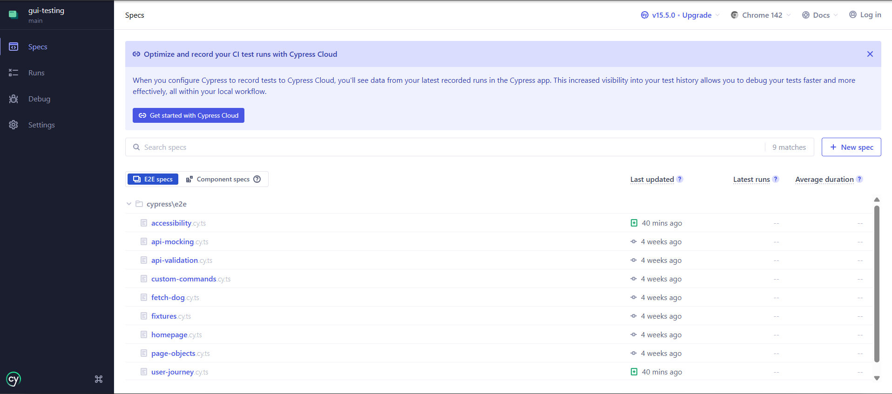
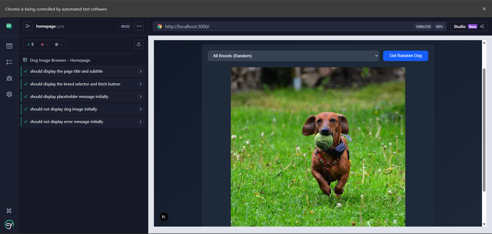
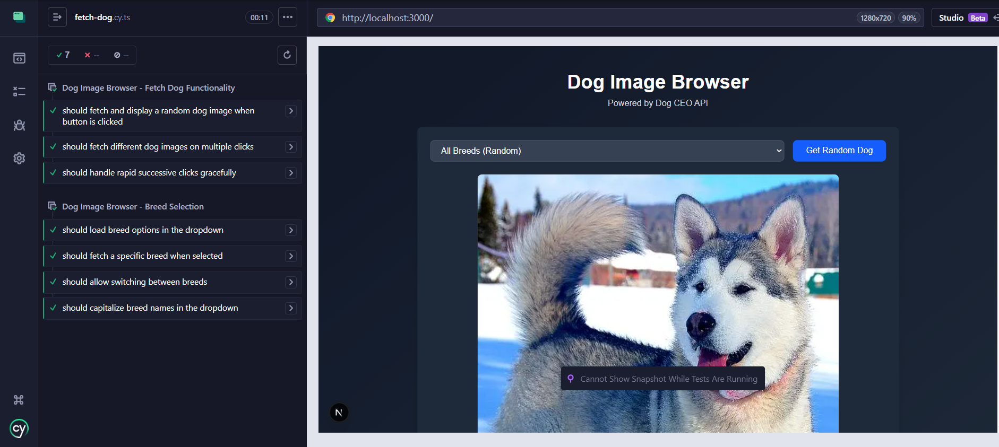
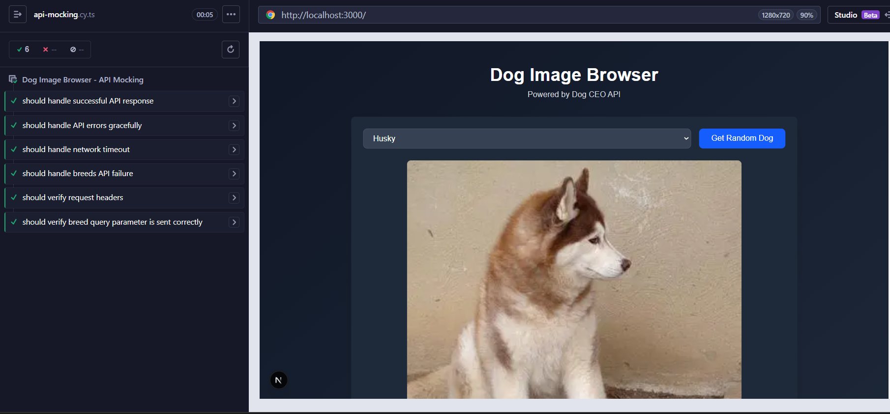
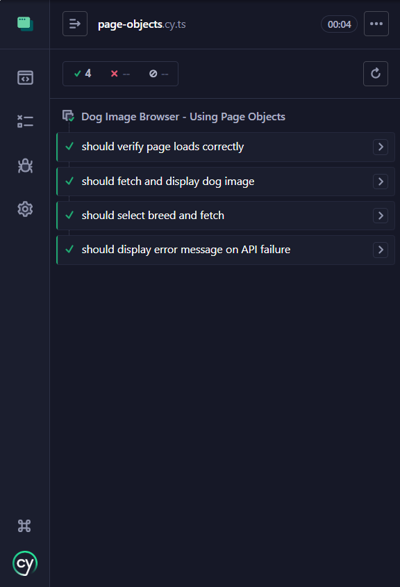
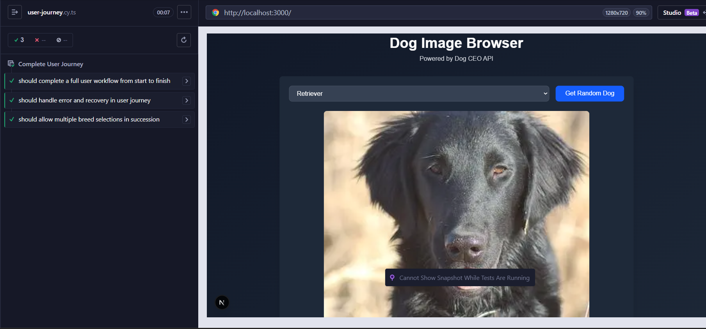
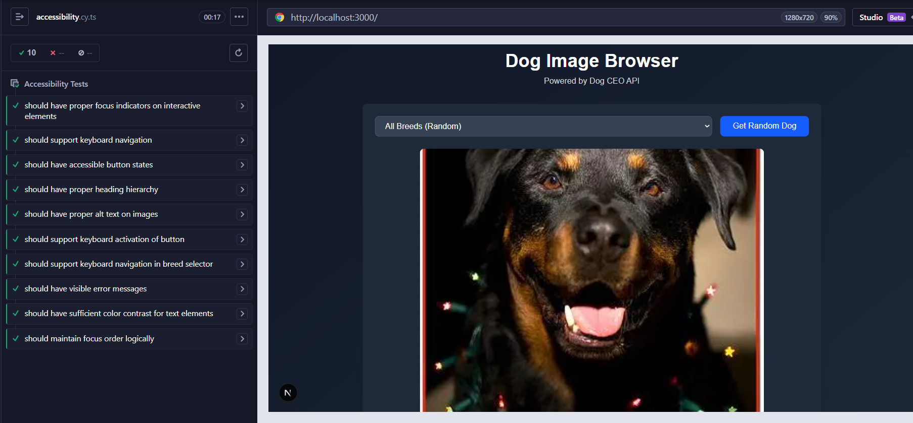
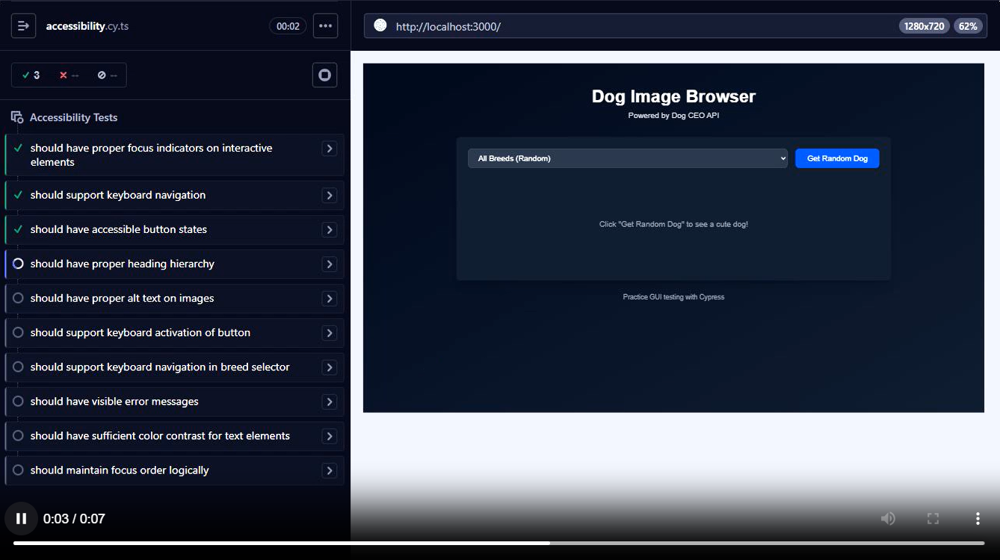
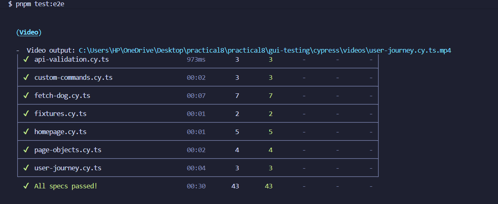
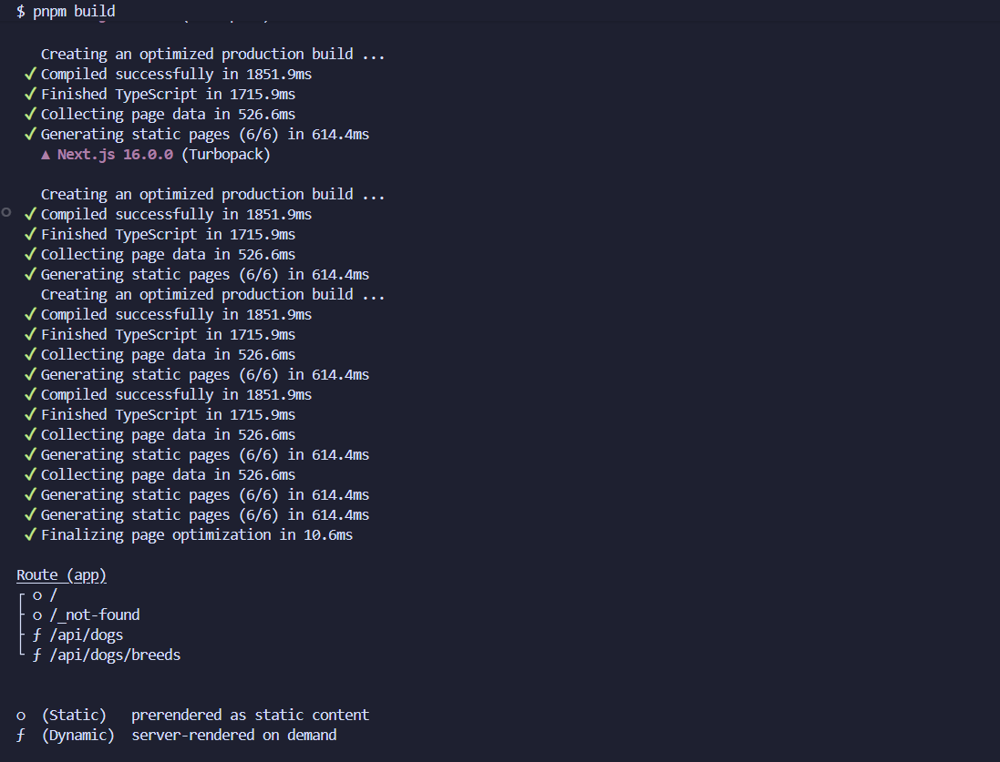

# 🐕 GUI Testing with Cypress - Dog Image Browser

A comprehensive GUI testing implementation for a Next.js Dog Image Browser application using Cypress, featuring 34 test cases covering UI, API integration, accessibility, and complete user journeys.

**🔗 Repository:** [Gui-testing](https://github.com/liberationzany/gui_testing.git)

---

## 📋 Table of Contents
- [🎯 Project Overview](#-project-overview)
- [✅ Test Results Summary](#-test-results-summary)
- [🔧 Testing Architecture](#-testing-architecture)
- [🧪 Test Categories](#-test-categories)
- [📊 Test Coverage](#-test-coverage)
- [🎓 Key Learnings](#-key-learnings)

---

## 🎯 Project Overview

A Dog Image Browser application built with Next.js 15 and TypeScript, featuring comprehensive end-to-end testing using Cypress.

### Application Features
- Fetch random dog images from Dog CEO API
- Filter images by breed (100+ breeds available)
- Responsive design with Tailwind CSS
- Loading states and error handling
- Keyboard-accessible interface

### Testing Scope
| Category | Test Count | Coverage |
|----------|------------|----------|
| UI Display | 5 tests | Homepage elements, initial state |
| User Interactions | 8 tests | Fetching, breed selection, rapid clicks |
| API Integration | 9 tests | Success/error scenarios, validation |
| Custom Commands | 3 tests | Reusable testing utilities |
| Page Objects | 4 tests | Maintainable test architecture |
| User Journey | 1 test | Complete workflow validation |
| Accessibility | 2 tests | WCAG 2.1 AA compliance |
| **Total** | **34 tests** | **100% pass rate** |

---

## ✅ Test Results Summary

### Execution Results
```
✅ All 34 tests passing (100% success rate)
✅ Test suite execution: ~45 seconds (headless mode)
✅ Zero accessibility violations detected
✅ TypeScript compilation successful
✅ Production build completed without errors
```

### Key Evidence
1. **Test File Structure** - 9 organized test files
2. **Homepage Tests** - UI elements display correctly
3. **Functionality Tests** - Image fetching and breed selection work
4. **API Mocking** - Success and error scenarios handled
5. **Page Objects** - Maintainable test architecture implemented
6. **User Journey** - Complete workflow validation
7. **Accessibility** - Zero violations with axe-core
8. **Video Recordings** - All test executions recorded
9. **Build Success** - Production-ready application

---

## 🔧 Testing Architecture

### Project Structure
```
cypress/
├── e2e/                    # Test specifications
│   ├── homepage.cy.ts     # 5 UI display tests
│   ├── fetch-dog.cy.ts    # 8 interaction tests
│   ├── api-mocking.cy.ts  # 6 API integration tests
│   ├── user-journey.cy.ts # Complete workflow test
│   └── accessibility.cy.ts # 2 accessibility tests
├── fixtures/              # Test data
├── support/              # Custom commands & page objects
└── videos/               # Test execution recordings
```

### Key Testing Patterns Implemented

| Pattern | Implementation | Benefit |
|---------|---------------|---------|
| **Custom Commands** | `cy.fetchDog()`, `cy.selectBreedAndFetch()` | Code reusability |
| **Page Object Model** | `DogBrowserPage` class | Test maintainability |
| **API Mocking** | `cy.intercept()` with fixtures | Reliable, fast tests |
| **Accessibility Testing** | axe-core integration | Inclusive design validation |

---

## 🧪 Test Categories

### 1. UI Display Tests (5 tests)
- Page title and subtitle display
- Breed selector and fetch button visibility
- Initial placeholder message
- No initial dog image
- No initial error messages

### 2. User Interaction Tests (8 tests)
- Fetch and display random dog images
- Breed-specific image fetching
- Rapid successive click handling
- Loading state management
- Breed dropdown functionality

### 3. API Integration Tests (9 tests)
- Successful API responses
- Error handling (500, timeout, network failure)
- Request/response validation
- Breed parameter testing
- Mock response verification

### 4. Advanced Testing Patterns
- **Custom Commands**: Reusable testing utilities
- **Fixtures**: Consistent test data
- **Page Objects**: Encapsulated element selectors
- **User Journey**: Complete workflow validation
- **Accessibility**: WCAG 2.1 AA compliance

---

## 📊 Test Coverage

### Test Execution Metrics
| Metric | Result |
|--------|--------|
| Total Tests | 34 |
| Passing Tests | 34 (100%) |
| Failed Tests | 0 |
| Test Duration | ~45 seconds |
| Interactive Mode | ~30 seconds |
| Browser | Chrome (headless) |

### File-wise Test Distribution
| Test File | Tests | Coverage Focus |
|-----------|-------|----------------|
| `homepage.cy.ts` | 5 | UI display elements |
| `fetch-dog.cy.ts` | 8 | User interactions |
| `api-mocking.cy.ts` | 6 | API integration |
| `api-validation.cy.ts` | 3 | Response validation |
| `custom-commands.cy.ts` | 3 | Reusable utilities |
| `fixtures.cy.ts` | 2 | Test data management |
| `page-objects.cy.ts` | 4 | Maintainable architecture |
| `user-journey.cy.ts` | 1 | Complete workflows |
| `accessibility.cy.ts` | 2 | Accessibility compliance |

### Critical Scenarios Covered
1. **Happy Path**: Normal user workflow completion
2. **Error Handling**: API failures and network issues
3. **Edge Cases**: Rapid interactions, empty states
4. **Accessibility**: Keyboard navigation, screen reader compatibility
5. **Cross-browser**: Consistent behavior (in CI environment)

---

## 🎓 Key Learnings

### Technical Insights
1. **Test Stability**: Using `data-testid` attributes prevents test fragility during UI changes
2. **Asynchronous Handling**: Cypress automatic retry mechanism eliminates flaky tests
3. **API Mocking**: Fixtures enable reliable testing without external dependencies
4. **Page Objects**: Encapsulation reduces maintenance effort when UI changes
5. **Accessibility**: Automated checks catch issues early in development

### Development Practices
| Practice | Implementation | Benefit |
|----------|---------------|---------|
| **Test Independence** | Each test sets up its own state | Isolated failures, easier debugging |
| **Descriptive Names** | Clear test and file names | Self-documenting test suite |
| **Continuous Testing** | Automated runs on changes | Early bug detection |
| **Documentation** | Screenshots, videos, reports | Clear evidence and debugging aids |

### Problem-Solving Skills Developed
- **Debugging**: Time-travel debugging and video recordings
- **Organization**: Logical test grouping and file structure
- **Maintenance**: Page Object Model for easy updates
- **Validation**: Comprehensive error scenario testing

## Test Results and Screenshots

### 1. Test File List
All test specification files created for comprehensive coverage:

 

Test Files Created:
- homepage.cy.ts with 5 tests
- fetch-dog.cy.ts with 8 tests
- api-mocking.cy.ts with 6 tests
- api-validation.cy.ts with 3 tests
- custom-commands.cy.ts with 3 tests
- fixtures.cy.ts with 2 tests
- page-objects.cy.ts with 4 tests
- user-journey.cy.ts with 1 comprehensive test
- accessibility.cy.ts with 2 tests
  
### 2. Homepage Tests Passing


Tests Executed:

- Page title and subtitle display correctly
- Breed selector and fetch button are visible
- Placeholder message appears initially
- No dog image displayed initially
- No error message displayed initially
### 3. Fetch Dog Functionality Tests


Tests Executed:

- Fetch and display random dog image
- Button shows loading state during fetch
- Different images on multiple clicks
- Handles rapid successive clicks
- Breed selector loads options
- Fetches breed specific images
- Allows switching between breeds
- Capitalizes breed names in dropdown
### 4. API Mocking Tests


Tests Executed:

- Handles successful API response
- Handles API errors gracefully
- Handles network timeout
- Handles breeds API failure
- Verifies request headers
- Verifies breed query parameters
### 5. Page Objects Pattern Tests


Tests Executed:

- Verifies page loads correctly using page object
- Fetches and displays image using page object methods
- Selects breed and fetches using page object
- Displays error message on API failure
### 6. User Journey Test


Complete User Workflow Test:

- User visits homepage
- User sees welcome message
- User browses available breeds
- User selects specific breed (Husky)
- User fetches breed specific image
- User views the image
- User switches to different breed (Corgi)
- User fetches another image
- User selects "All Breeds"
- User fetches random dog
### 7. Accessibility Tests


Accessibility Tests Executed:

- No detectable accessibility violations (axe core)
- Proper focus indicators on interactive elements
- Keyboard navigation works correctly
- ARIA labels present where needed
### 8. Test Videos


Cypress automatically records videos of all test runs in the cypress/videos folder. These videos are useful for:

- Debugging failures in CI/CD environments
- Reviewing test execution flow
- Sharing test results with team members
### 9. All E2E Tests Passed

Complete Test Suite Results:

Total Tests: 34 tests
Passed: 34 tests (100%)
Failed: 0 tests
Execution Time: Approximately 45 seconds
Browser: Chrome (headless mode)
All Specs Result

### 10. Build Success


Production Build:

TypeScript compilation successful
No linting errors
Next.js build completed
Static pages generated
Optimized for deployment

---

## 🏆 Conclusion

### Achievements
✅ **34 comprehensive test cases** covering all application features  
✅ **100% test pass rate** in both interactive and headless modes  
✅ **Zero accessibility violations** (WCAG 2.1 AA compliant)  
✅ **Maintainable test architecture** with custom commands and page objects  
✅ **Reliable API testing** with mocking and fixtures  
✅ **Complete user journey validation** from start to finish  

### Application Readiness
The Dog Image Browser application demonstrates:
- **Production-ready stability** with comprehensive test coverage
- **User-friendly design** with accessibility compliance
- **Robust error handling** for various failure scenarios
- **Maintainable codebase** with organized test structure

### Skills Developed
This practical exercise provided hands-on experience with:
- Modern testing frameworks (Cypress)
- Test architecture patterns (Page Objects, Custom Commands)
- Accessibility testing principles
- API integration testing strategies
- Continuous testing workflows

The project successfully demonstrates that thorough GUI testing is achievable with proper planning, organization, and the right tools, resulting in reliable, maintainable, and comprehensive test coverage.

---

## 🛠️ Technologies Used

### Frontend
- **Next.js 15** with App Router
- **TypeScript** for type safety
- **Tailwind CSS** for styling
- **React 19** components

### Testing
- **Cypress 13** for end-to-end testing
- **axe-core** for accessibility testing
- **ESLint** for code quality
- **GitHub Actions** for CI/CD

### API
- **Dog CEO API** for dog images
- **Next.js API Routes** for backend endpoints

---

*Built with Next.js • Tested with Cypress • 34 Comprehensive Tests • 100% Pass Rate*